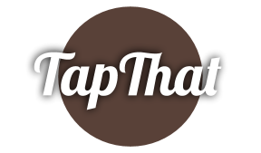

=====

Connecting You to Brew.
=====

 

The TapThat Team:
-----
### Kevinn Arbas, Ryan George, Michael Hinte

 

Our Mission:
=====

TapThat is designed to connect Brewers, Restaurants, and Beer enthusiasts through an intuitive “Tap It!” system that tracks your favorite beers and where to find them.
-----
    
 
   
The Problem We Solve:
-----
   
* There are many reasons we become “regulars”  at our favorite bars. Sometimes for the people or the atmosphere, but usually for the product. Too often we find a new craft beer that keeps us coming back for more, only to find one day that it’s been rotated out for something less savory.

* While most breweries have on-location bars or hold tours, the majority of their sales happen at third-party restaurants and bars. Most communication takes place between that bar and the brewery, leaving the customer guessing as to where the next great brews will pop up.

 

How Does It Work?
-----
  
* Public Users may log-in to browse the app to search for their favorite beers or discover new beers.
  
* Users can save their favorite beers to their "cooler", to keep track of where there favorite brew is on tap.

* Users can also track restaurants that currently have their favorite beers on tap.

 

Technologies Used:
-----
* Python
* PostgreSQL
* Django
* Javascript
* BreweryDB API
* HTML
* Materialize CSS
* Heroku

